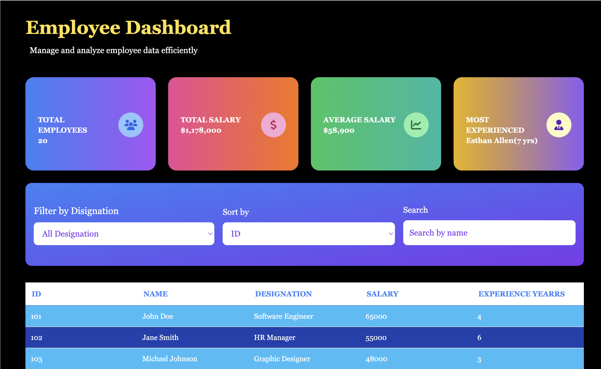

# 📊 Employee Dashboard

A sleek and responsive Employee Management Dashboard built using **HTML**, **Tailwind CSS**, and **JavaScript**. Easily manage, search, sort, and filter employee data through an interactive UI.

---

## 🚀 Features

- 🔍 Search employees by name
- ⬆️ Sort by ID, Name, Salary, or Experience
- 🎯 Filter by Designation
- 📊 Display total employees, total salary, and average salary
- 🎨 Beautiful responsive UI using TailwindCSS
- 🌓 Light/Dark themed card gradients
- 📱 Mobile & desktop responsive layout

---

## 🧪 Technologies Used

| Tech | Description |
|------|-------------|
| **HTML5** | Markup for the UI |
| **Tailwind CSS** | Utility-first modern CSS framework |
| **JavaScript** | DOM Manipulation & Logic |
| **Font Awesome** | Icon library for cards |

---

## 📸 Screenshots

<!-- Replace with your actual image link -->

---

## 🛠️ Getting Started

To run the project locally:

1. Clone this repo:
   ```bash
   git clone https://github.com/yourusername/employee-dashboard.git
